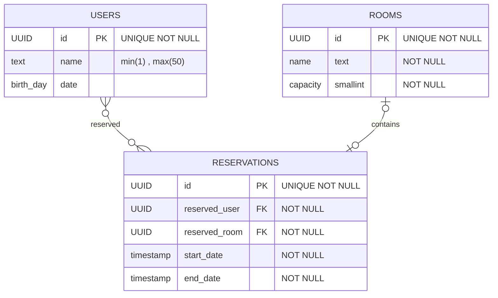

# これは何？
ここのディレクトリでは、データベースの設計に関するドキュメントを管理します。

## ファイルの説明
- `init.sql`: データベースの初期化を行うためのSQL文を記述します。

### 環境
今回は、PostgreSQLを使用します。
PostgreSQLの詳細については、[公式ドキュメント](https://www.postgresql.jp/document/12/html/index.html)を参照してください。

### schemaについて
このdiagarmは、[mermaid](https://mermaid-js.github.io/mermaid/#/)記法を使用しています。

