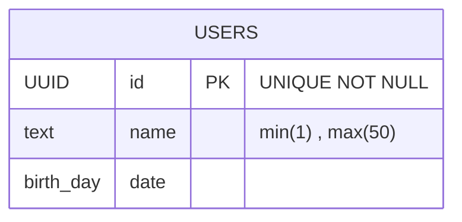

# これは何？

これはwebapp_studyのアカウント機能についてのdesigndocです。

これを確認すればAPI仕様とデータベースの構成について確認することができます。

## API仕様
endpoint: /api/v1/userdata

method: POST,GET,DELETE

| method | query | | 具体例 | body |
| --- | --- | --- | --- | -- |
| POST | name | birth_day | /api/v1/userdata | name="John"&birth_day="2023/11/04" |
| GET | name | id | /api/v1/userdata?name="John" | |
| DELETE | id | | /api/v1/userdata | |

### Success response

| status | message |
| --- | --- | 
| 200 | OK |

### Error response
| status | message |
| --- | --- | 
| 400 | Bad Request |
| 404 | Not Found |
| 500 | Internal Server Error |

## DB_Table

### HttpHeader

| JSON KEY | 型 | 補足 |
| --- | --- | --- |
| Content-Type | string | application/json |

### HttpBody
Postメソッドの時のみ必要

| JSON KEY | 型 | 必須(Bool) |　サイズ | 補足 |
| --- | --- | --- | --- | --- |
| name | string | true | min(1) , max(50) | |
| id | UUID | true | | uuid_ver4で実装 |
| birth_day | date | false | | フロントで表示するのは、yyyy/mm/ddだがBackendは時間まで登録されている |
