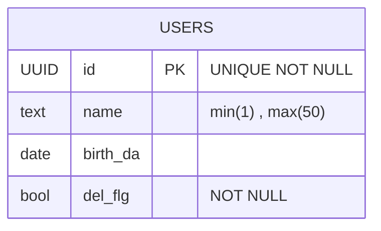

# これは何？

これはwebapp_studyのアカウント機能についてのdesigndocです。

これを確認すればAPI仕様とデータベースの構成について確認することができます。

# API仕様
## Endpoint
/api/v1/userdata
### method
POST,GET

| method | query | | 具体例 | body |
| --- | --- | --- | --- | -- |
| GET |  |  | /api/v1/userdata | |
| POST | name | birth_day | /api/v1/userdata | name="John"&birth_day="2023/11/04" |

### APIエンドポイントの説明
このAPIはユーザーのデータを一覧で取得することができます。
このAPIで定義されているPOSTメソッドは、ユーザーのデータを新規登録することができます。

### Success response

| status | message |　desc |
| --- | --- | --- |
| 200 | OK | ユーザーのデータを取得することができた時に発生 |
| 201 | Created | ユーザーのデータを新規登録することができた時に発生 |

### Error response
| status | message | desc |
| --- | --- | --- |
| 400 | Bad Request | ユーザーのデータを新規登録する時のクエリ設定が間違っていた時に発生 |
| 404 | Not Found | ユーザーのデータがなかった時に発生する |
| 500 | Internal Server Error | その他の不明な内容 |

## Endpoint
/api/v1/userdata/{UUID}
### method
GET,DELETE,PATCH

| method | query | | 具体例 | body |
| --- | --- | --- | --- | -- |
| GET | uuid |  | /api/v1/userdata/{UUID} | |
| DELETE | uuid | | /api/v1/userdata/{UUID} | |
| PATCH | uuid | | /api/v1/userdata/{UUID} |  name="John"&birth_day="2023/11/04" |

### APIエンドポイントの説明
このAPIは指定したユーザーのデータを一件取得することができます。
DELETEメソッドは指定したユーザーのデータを削除することができます。
PATCHメソッドは指定したユーザーのデータを更新することができます。

### Success response

| status | message |　desc |
| --- | --- | --- |
| 200 | OK | ユーザーのデータを取得することができた時に発生 |
| 201 | Created | ユーザーのデータを削除、更新することができた時に発生 |

### Error response
| status | message | desc |
| --- | --- | --- |
| 400 | Bad Request | 更新する時のクエリ設定が間違っていた時に発生 |
| 404 | Not Found | UUIDで指定したリソースがなかった時に発生する |
| 500 | Internal Server Error |　その他の不明な内容 |

## DB_Table

### HttpHeader

| JSON KEY | 型 | 補足 |
| --- | --- | --- |
| Content-Type | string | application/json |

### HttpBody
Postメソッドの時のみ必要

| JSON KEY | 型 | 必須(Bool) |　サイズ | 補足 |
| --- | --- | --- | --- | --- |
| name | string | true | min(1) , max(50) | |
| id | UUID | true | | uuid_ver4で実装 |
| birth_day | date | false | | フロントで表示するのは、yyyy/mm/ddだがBackendは時間まで登録されている |
