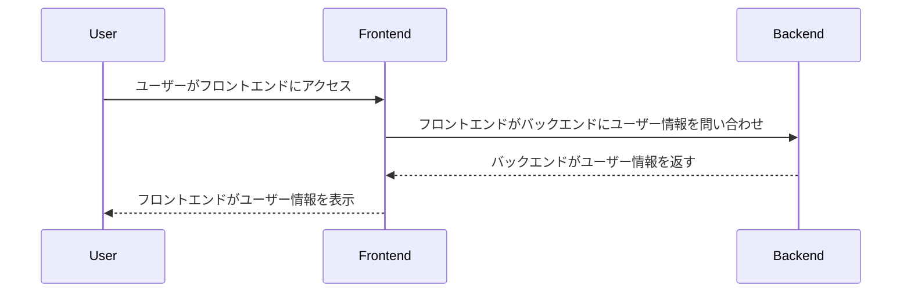
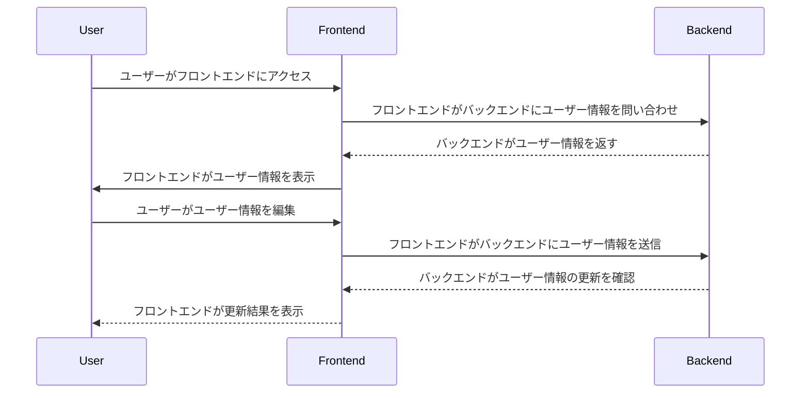
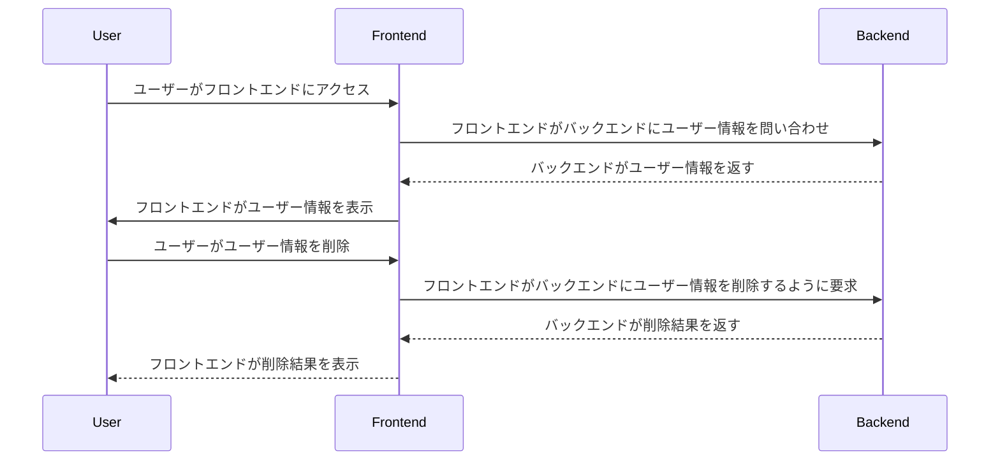

# 解決すべき課題
現在のシステムでは、ユーザーの情報を操作できない

ユーザーの情報を追加できるようにするためには、ユーザーのアカウント管理機能を実装する必要がある

求められるのは、ユーザー自身の情報を確認できること、編集できること、削除できることである

これができれば、ブラウザ上でユーザーが自分の情報を管理できるようになる

# ユーザーストーリー
- ユーザーは、フロントエンドから自分のアカウントの情報を確認することができる

- ユーザーは、フロントエンドから自分のアカウントの情報を編集することができる

- ユーザーは、フロントエンドから自分のアカウント情報を削除することができる

